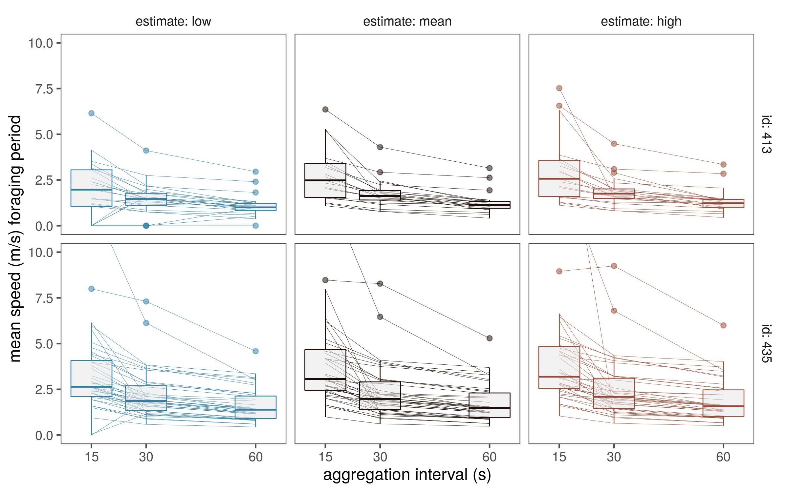
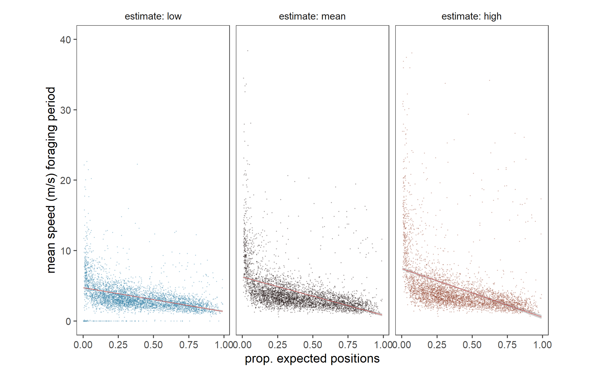

# Applying CTMM to WATLAS data

Here, we examine the effect of different aggregation scales on CTMM fits and speed estimates.

## Load libraries

```{r load_libs_supp_01, eval=FALSE}
# load libs
library(data.table)
library(glue)
library(stringr)
library(tibble)
library(dplyr)
library(tidyr)
library(forcats)

# plot libs
library(ggplot2)
library(ggthemes)
library(scico)

# ssh func
library(ssh)
```

## Load prelim data

```{r prep_data_s01, eval=FALSE}
# load data
# make a list of data files to read
data_files <- list.files(path = "data/watlas", pattern = "whole_season*", full.names = TRUE)

data_ids <- str_extract(data_files, "(tx_\\d+)") %>% str_sub(-3,-1)

# read deployment data from local file in data folder
tag_info <- fread("data/SelinDB.csv")

# filter out NAs in release date and time
tag_info <- tag_info[!is.na(Release_Date) & !is.na(Release_Time),]

# make release date column as POSIXct
tag_info[,Release_Date := as.POSIXct(paste(Release_Date, Release_Time, sep = " "), 
                                     format = "%d.%m.%y %H:%M", tz = "CET")]

# sub for knots in data
data_files <- data_files[as.integer(data_ids) %in% tag_info$Toa_Tag][1:10]
data_ids <- str_extract(data_files, "(tx_\\d+)") %>% str_sub(-3,-1)

```

## Choose scales of aggregation

```{r choose_agg_scale, eval=FALSE}
scales <- c(15, 30, 60)

data_to_test <- crossing(scales, nesting(data_files, data_ids))
rm(scales, data_files)
```

## Transfer data and process on cluster

```{r count_patches_remaining, eval=FALSE}
# read password
password = fread("data/password.txt")$password

# transfer code files
{
  s <- ssh_connect("p284074@peregrine.hpc.rug.nl", passwd = password)
  rfiles <- list.files("code", pattern = ".r", full.names = TRUE)
  scp_upload(s, rfiles, to = "code/")
  ssh_disconnect(s)
}

# clear old speed estimates
{
  s <- ssh_connect("p284074@peregrine.hpc.rug.nl", passwd = password)
  ssh_exec_wait(s, command = "rm output/speed_estimates_2018.csv")
  ssh_disconnect(s)
}

# execute tests
for(i in 1:nrow(data_to_test)){
  
  scale <- data_to_test$scales[i]
  file <- data_to_test$data_files[i]
  id <- data_to_test$data_ids[i]
  # connect to peregrine
  s <- ssh_connect("p284074@peregrine.hpc.rug.nl", passwd = password)
  # make directory if non-existent
  ssh_exec_wait(s, command = "mkdir -p data/watlas")
  
  # list files already present
  files_on_prg <- ssh_exec_internal(s, command = "ls data/watlas")
  files_on_prg <- rawToChar(files_on_prg$stdout) %>% 
    str_split("\n") %>% 
    unlist()
  
  # check name
  data_name <- file %>% 
    str_split("/") %>% 
    unlist() %>% .[3]
  
  if(!data_name %in% files_on_prg){
    # upload data file for processing
    scp_upload(s, file, to = "data/watlas")
  }
  
  # make job file
  {
    shebang <- readLines("code/template_job.sh")
    
    # rename job
    shebang[2] <- glue('#SBATCH --job-name=ctmm_{file}')
    
    text <- glue('Rscript --vanilla code/code_test_ctmm_scale.r {file} {scale}')
    jobfile <- glue('code/job_ctmm_{id}_{scale}.sh')
    
    writeLines(c(shebang, text), con = jobfile)
    scp_upload(s, jobfile, to = "code/")
  }
  
  ssh_exec_wait(s, command = glue('dos2unix {jobfile}'))
  # process using ctmm
  ssh_exec_wait(s, command = glue('sbatch {jobfile}'))
  
  # disconnect
  ssh_disconnect(s)
  
}
```

## Get speed estimates from cluster

```{r get_speed_estimates_supp, eval=FALSE}
# access data from cluster
{
  s <- ssh_connect("p284074@peregrine.hpc.rug.nl", passwd = password)
  scp_download(s, files = "output/speed_estimates_2018.csv", to = "data/mod_output/")
  ssh_disconnect(s)
}

# read data and process for plotting
{
  data <- fread("data/mod_output/speed_estimates_2018.csv", fill = T)
  data <- setDF(data) %>% 
    as_tibble() %>% 
    filter(!is.na(id)) %>% 
    rename(mean = est) %>% 
    pivot_longer(cols = c(low, mean, high),
                       names_to = "estimate", values_to = "speed") %>% 
    filter(!is.infinite(speed)) %>% 
    mutate(estimate = as.factor(estimate),
           estimate = fct_relevel(estimate, "low", "mean", "high"))
}
```

### Plot speed at different scales

```{r fig_compare_ctmm, eval=FALSE}
# plot data as lines
fig_compare_ctmm <- ggplot(data)+
  geom_line(aes(x = tide_number, y = speed, group = interaction(id, tide_number),
                col = factor(estimate)), size = 0.1)+
  
  geom_boxplot(aes(x = scale, y = speed, group = interaction(scale),
                col = factor(estimate)), size = 0.3, notch = F, 
               fill = "grey90", alpha= 0.5)+
  facet_grid(id~estimate, labeller = label_both)+
  scale_x_continuous(breaks = c(15,30,60))+
  scale_colour_scico_d(palette = "berlin", begin = 0.2, end = 0.8)+
  coord_cartesian(ylim = c(0,10))+
  theme_few()+
  theme(legend.position = "none")+
  labs(x = "aggregation interval (s)", y = "mean speed (m/s) foraging period")

# save figure
ggsave(fig_compare_ctmm, filename = "figs/fig_compare_scale.png", height = 5, width = 8, dpi=300)
dev.off()
```

```{r show_fig_compare_scale, eval=TRUE, fig.cap="Effect of aggregation scale on CTMM speed estimates, using 2 individual red knots over all tidal cycles in which they were tracked, and which satisfied quality criteria."}



```

### Plot speed in relation to proportion of positions

```{r fig_speed_quality, eval=FALSE}
# figure speed estimate ~ quality
fig_speed_quality <-
  ggplot(data %>% filter(speed <= 5))+
  geom_jitter(aes(x = prop_fixes, y = speed, group = id,
                col = factor(estimate)), size = 0.1, alpha = 0.5)+
  geom_smooth(aes(x = prop_fixes, y = speed,
                col = factor(estimate)), alpha = 0.5,
              method = "lm")+
  
  # geom_boxplot(aes(x = scale, y = speed, group = interaction(scale),
  #               col = factor(estimate)), size = 0.3, notch = F, 
  #              fill = "grey90", alpha= 0.5)+
  facet_wrap(~estimate, labeller = label_both, ncol = 3)+
  # scale_x_continuous(breaks = c(15,30,60))+
  scale_colour_scico_d(palette = "berlin", begin = 0.2, end = 0.8)+
  coord_fixed(ylim = c(0,5), ratio = 0.1)+
  theme_few()+
  theme(legend.position = "none")+
  labs(x = "prop. expected positions", y = "mean speed (m/s) foraging period")

# save figure
ggsave(fig_speed_quality, filename = "figs/fig_speed_quality.png", height = 5, width = 8, dpi=300)
dev.off()
```

```{r show_fig_compare_qual, eval=TRUE, fig.cap="Effect of proportion of positions realised on CTMM speed estimates."}



```

## Get models as `.Rdata` objects

```{r get_rdata, eval=FALSE}
# download model data folder
{
  s <- ssh_connect("p284074@peregrine.hpc.rug.nl", passwd = password)
  scp_download(s, files = "output/mods", to = "data/mod_output/")
  ssh_disconnect(s)
}

```

